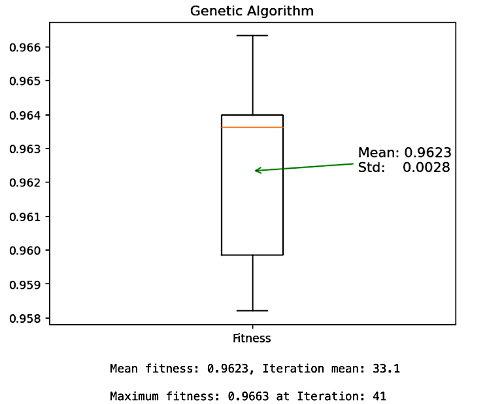
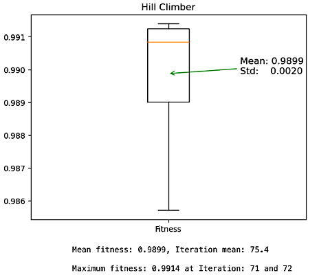

# Test Case Prioritization

This project involves using a genetic algorithm and a basic hill climber on some real data sets to solve a test case prioritisation problem: identifying the optimal order in which the set of tests should be run.

The 'newsmallfaultmatrix' dataset was used for testing while the 'newbigfaultmatrix' dataset was used for the main analysis.

## Datasets

- The file 'smallfaultmatrix.txt' comes from a system called NanoXML, a lightweight XML parser. Each line in the file consists of a test number followed by 9 comma separated 1's and 0's which indicate which of the 9 faults the test case finds.
- The 'bigfaultmatrix.txt' contains 38 faults and 379 tests in the same sort of format.

The aim is to identify for each of the tests in both datasets, which of the associated faults they reveal - indicated by a 1.

## Results

Both genetic algorithm and hill climbing successfully produced improved solutions that outperformed the initial order of the test suite.

 

The initial fitness of 'newsmallfaultmatrix' dataset is 0.8969, and 'newbigfaultmatrix' dataset is 0.8908

**GA:** The maximum optimum fitness of the newbigfaultmatrix dataset: 0.9663

**Hill Climber:** The maximum optimum fitness of the newbigfaultmatrix dataset: 0.9914
